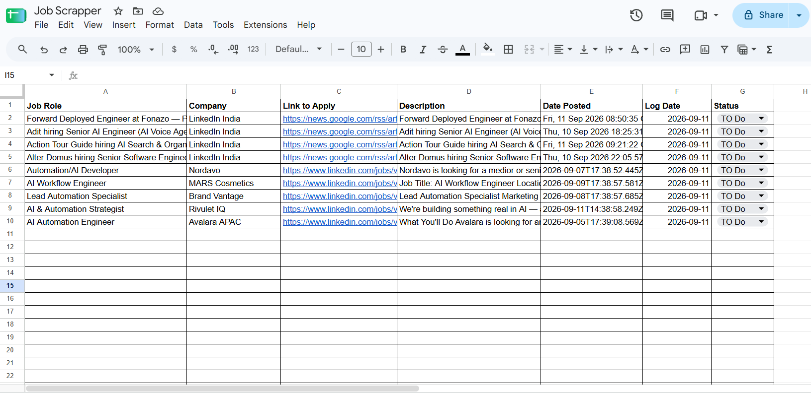

# 🔎 LinkedIn Job Scraper to Google Sheets
Finding jobs manually can take a lot of time. we need to search for jobs, check different sources, copy the details, and maintain a job-tracking sheet.
This automation does those repetitive tasks for us
when providing with a **job title** and choose whether we want **remote jobs**. The workflow searches for relevant LinkedIn jobs, collects the job details, and automatically adds them to a **Google Sheet**.

### 💡 How It Works
```text
You
 │
 │ Job title + Remote preference
 ▼
Automation
 │
 ├── Search recent LinkedIn jobs
 │
 ├── Collect job details
 │
 ├── Check if the data is ready
 │
 └── Combine the results
          │
          ▼
     Append in Google Sheets
```

The workflow uses two sources to find jobs:
* 🔍 **Google News** — finds recent LinkedIn job postings
* 💼 **Bright Data** — collects structured LinkedIn job information

The results from both sources are combined and saved into one Google Sheet.


### 📥 What Do I Need to Provide?
The automation expects two simple inputs:

| Input      | What it means                       | Example            |
| - | -- |  |
| `jobTitle` | The type of job you are looking for | `Golang Developer` |
| `isRemote` | Whether you want remote jobs        | `true`             |

### Example
```json
{
  "jobTitle": "Golang Developer",
  "isRemote": true
}
```

we can also search for other roles:
```json
{
  "jobTitle": "Data Engineer",
  "isRemote": true
}
```
If we don't provide these values, the workflow uses **n8n** as the job title and **remote jobs** as the default.

### ⚙️ What Needs to Be Configured?
Before running the workflow, need to configure:

### 1. Bright Data
Add the **Bright Data API token** to the workflow.
Bright Data is used to collect LinkedIn job information.

### 2. Google Sheets
Connect the **Google Sheets account** and select the spreadsheet where we want the job results to be stored.

### 3. Webhook
The workflow provides a webhook that accepts the job search request.
Once these are configured, the workflow is ready to use.

### 📦 How to Set It Up
1. Open your **n8n** account.
2. [Import the workflow JSON from this repository](linkedin-job-scraper.json)
3. Connect to the **Google Sheets account**.
4. Add the **Bright Data API token**.
5. Select the Google Sheet where you want to save the jobs.
6. Save and activate the workflow.

### ▶️ How to Run It
The workflow is triggered through a webhook.
### Example
```bash
curl -X POST \
  "YOUR_N8N_WEBHOOK_URL/job-scraper-api" \
  -H "Content-Type: application/json" \
  -d '{
    "jobTitle": "Golang Developer",
    "isRemote": true
  }'
```

Replace:
```text
YOUR_N8N_WEBHOOK_URL
```
with your n8n webhook URL.

### 🔄 What Happens After Running It?
Once the request is received, the workflow automatically:

1. Searches for recent LinkedIn jobs.
2. Collects the available job details.
3. Checks whether the LinkedIn data is ready.
4. Combines the results from both sources.
5. Adds the results to Google Sheets.

If the LinkedIn data is not ready yet, the workflow waits and checks again automatically.

### 📊 Google Sheets Output
The final results are stored in Google Sheets with the following information:

| Column            | Description                         |
| -- | -- |
| **Job Role**      | Job title                           |
| **Company**       | Company name                        |
| **Link to Apply** | Job application link                |
| **Description**   | Job description                     |
| **Date Posted**   | Date the job was posted             |
| **Log Date**      | Date the workflow processed the job |



New job results are **added to the existing sheet**, so previous records are not removed.
## 🛠️ Tools Used
* **n8n** — Automates the workflow
* **Google News RSS** — Finds recent LinkedIn job postings
* **Bright Data** — Collects LinkedIn job information
* **Google Sheets** — Stores the job results
* **JavaScript** — Processes the collected data
